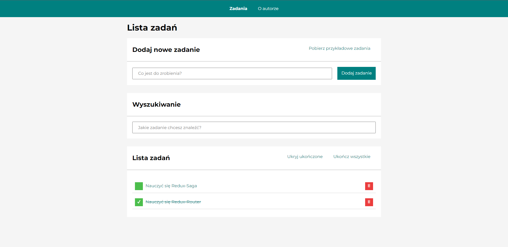

# Tasks List 📝



## Project Overview 🎉

This is a simple application that allows you to create a list of tasks. You can add, edit, delete and mark as completed.
Tasks are kept in the local storage, so they are not lost after refreshing the page. You can also get an example list of tasks by clicking the "Get example tasks" button. The application is based on the React library and uses Redux for state management. The application is fully responsive and works on all devices.

## Live 📍

### [Demo](https://piotrpaczuski.github.io/todos-list-react-typescript/)

## Tech/framework used 🔧

| Tech                                                                                                          | Description                                                                                                                                                                                 |
|---------------------------------------------------------------------------------------------------------------|---------------------------------------------------------------------------------------------------------------------------------------------------------------------------------------------|
| [HTML5](https://developer.mozilla.org/en-US/docs/Web/Guide/HTML/HTML5)                                        | Markup language used for structuring and presenting content on the web                                                                                                                      |
| [CSS3](https://developer.mozilla.org/en-US/docs/Web/CSS)                                                      | Style sheet language used for describing the presentation of a document written in a markup language like HTML                                                                              |
| [JS/ES6+](https://developer.mozilla.org/en-US/docs/Web/JavaScript)                                            | Programming language that conforms to the ECMAScript specification                                                                                                                          |
| [Flexbox](https://developer.mozilla.org/en-US/docs/Web/CSS/CSS_Flexible_Box_Layout/Basic_Concepts_of_Flexbox) | A flexible box layout module, that aims at providing a more efficient way to lay out, align and distribute space among items in a container, even when their size is unknown and/or dynamic |
| [Grid](https://developer.mozilla.org/en-US/docs/Web/CSS/CSS_Grid_Layout)                                      | A two-dimensional grid-based layout system that aims to do nothing more and nothing less than control the positioning and sizing of grid items                                              |
| [React](https://pl.legacy.reactjs.org/)                                                                       | The library for web and native user interfaces                                                                                                                                              |
| [React Router](https://reactrouter.com/)                                                                      | Declarative routing for React                                                                                                                                                               |
| [styled-components](https://styled-components.com/)                                                           | Use the best bits of ES6 and CSS to style your apps without stress                                                                                                                          |
| [Redux](https://redux.js.org/)                                                                                | A Predictable State Container for JS Apps                                                                                                                                                   |
| [Redux Toolkit](https://redux-toolkit.js.org/)                                                                | The official, opinionated, batteries-included toolset for efficient Redux development                                                                                                       |
| [Redux-Saga](https://redux-saga.js.org/)                                                                      | An intuitive Redux side effect manager                                                                                                                                                      |

[//]: # (## Screenshots 📺)

## Features 🚀
| Feature                  | Description                     |
|--------------------------|---------------------------------|
| `Responsive`             | Website is responsive           |
| `Animations`             | Website has animations          |
| `Local Storage`          | Tasks are kept in local storage |
| `Example Tasks`          | You can get example tasks       |
| `Add Task`               | You can add new task            |
| `Edit Task`              | You can edit task               |
| `Delete Task`            | You can delete task             |
| `Mark Task as Completed` | You can mark task as completed  |
| `Hide Completed Tasks`   | You can hide completed tasks    |

## Installation 💾

```bash
# Clone this repository
$ git clone

# Go into the repository
$ cd todos-list-react

# Install dependencies
$ npm install
    
# Run the app
$ npm run start
```

## Available scripts 👨‍💻

```bash
# Starts the development server.
$ npm run start

# Bundles the app into static files for production.
$ npm run build
```
